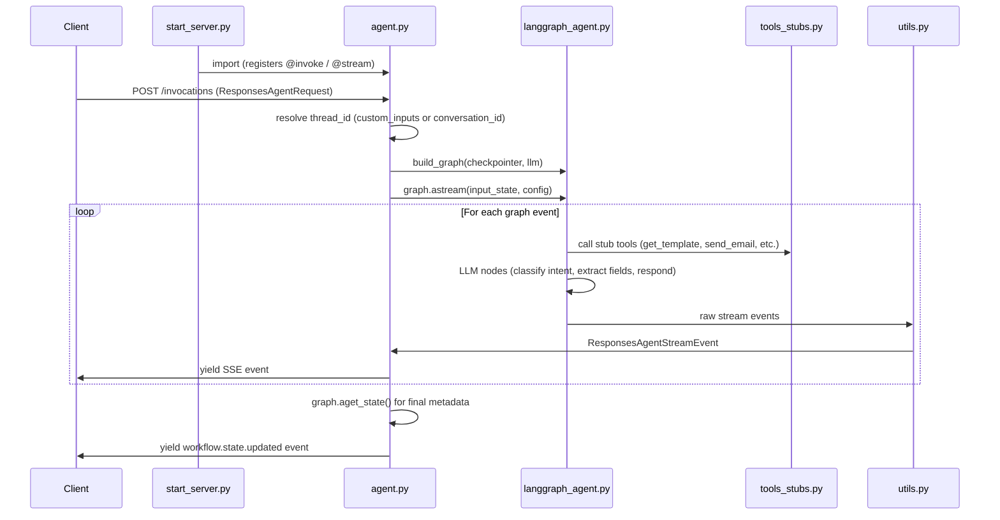
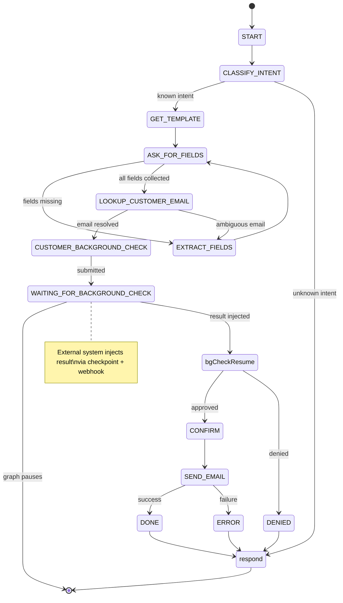
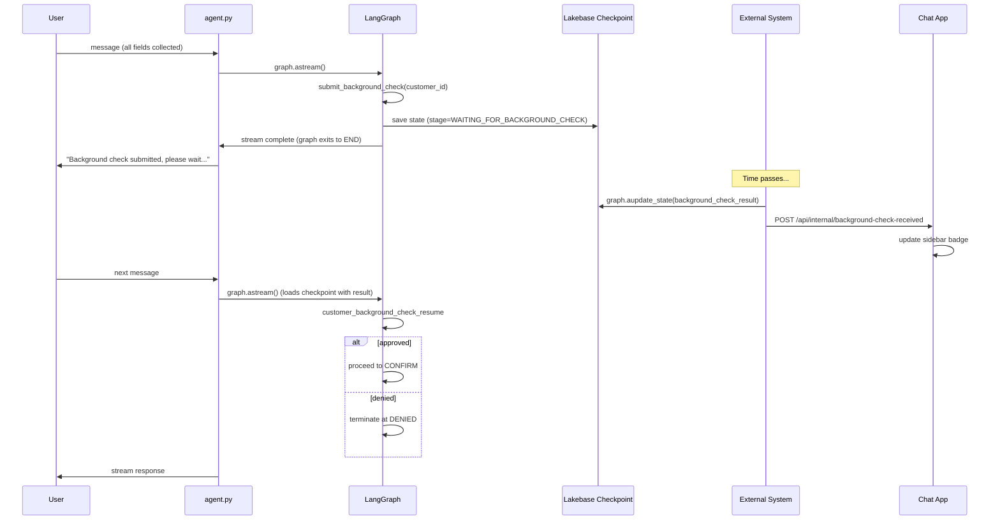

# Agent Server — Architecture

A LangGraph-based banking workflow agent exposed via the MLflow Responses API. The LLM handles natural-language understanding (intent classification, field extraction, conversational responses), but all routing between workflow stages is **deterministic** — the LLM never chooses the next step.

## File map


| File                 | Purpose                                                                                                                                                     |
| -------------------- | ----------------------------------------------------------------------------------------------------------------------------------------------------------- |
| `agent.py`           | MLflow entrypoint — `@invoke` and `@stream` handlers that receive requests, manage thread IDs, and wire up the LangGraph graph with a Lakebase checkpointer |
| `langgraph_agent.py` | State machine definition (`WorkflowState`), all graph nodes, LLM helper functions, and deterministic routing logic                                          |
| `tools_stubs.py`     | Deterministic stub tools (classify intent, get template, extract fields, look up email, render/send email) — no real backend needed                         |
| `utils.py`           | Stream-event processing — converts LangGraph stream events into `ResponsesAgentStreamEvent` objects for the Responses API                                   |
| `start_server.py`    | Boots the MLflow `AgentServer`, imports `agent.py` to register handlers                                                                                     |
| `send_background_check.py` | CLI tool to inject a background-check result into a waiting thread's Lakebase checkpoint and notify the chat app                                       |
| `evaluate_agent.py`  | MLflow GenAI evaluation harness (`mlflow.genai.evaluate`) with sample dataset and scorers                                                                   |
| `dev_smoke_test.py`  | In-process smoke tests using `MemorySaver` — no Lakebase or Databricks credentials required                                                                 |


## Request lifecycle




**Step by step:**

1. `start_server.py` boots the MLflow `AgentServer` and imports `agent.py`, which registers the `@invoke` and `@stream` handlers.
2. A client sends a `ResponsesAgentRequest` to `/invocations`. The `streaming()` handler resolves a `thread_id` from `custom_inputs.thread_id`, `context.conversation_id`, or generates a new UUID.
3. An `AsyncCheckpointSaver` (backed by Lakebase) is opened for the thread, and `build_graph(checkpointer, llm)` compiles the LangGraph state machine.
4. The graph processes the message through deterministic stage-based routing. `utils.py` transforms the raw LangGraph stream events into `ResponsesAgentStreamEvent` objects that are yielded back to the client.
5. After the graph run completes, `agent.py` emits a final `workflow.state.updated` event carrying the current `stage`, `intent`, and `customer_name`.

## The state machine

The graph routes strictly by `stage` — the LLM never decides transitions. Every user message enters through the `router` node, which classifies whether the message is a question or workflow data, then a conditional edge (`_route_by_stage`) dispatches to the appropriate node based on the current `stage` value.




### `WorkflowState`

The state is a `TypedDict` with the following fields:


| Field              | Type             | Description                                                        |
| ------------------ | ---------------- | ------------------------------------------------------------------ |
| `messages`         | `list`           | Conversation history (uses LangGraph's `add_messages` reducer)     |
| `stage`            | `str`            | Current workflow stage (drives all routing)                        |
| `intent`           | `str`            | Classified intent (`GENERATE_ACCOUNT_STATEMENT` or `OPEN_DEPOSIT`) |
| `required_fields`  | `list[str]`      | Fields required by the selected template                           |
| `field_values`     | `dict[str, str]` | Collected field values so far                                      |
| `missing_fields`   | `list[str]`      | Fields still needed from the user                                  |
| `template_id`      | `str`            | Selected email template identifier                                 |
| `template_body`    | `str`            | Template body with `{{placeholder}}` markers                       |
| `email_to`         | `str`            | Resolved recipient email                                           |
| `email_subject`    | `str`            | Rendered email subject                                             |
| `email_body`       | `str`            | Rendered email body                                                |
| `email_candidates` | `list[str]`      | Ambiguous email candidates (when lookup returns multiple)          |
| `background_check_request_id` | `Optional[str]`  | Request ID returned by `submit_background_check`                   |
| `background_check_result`     | `Optional[dict]` | Externally injected result (`{"status": "...", "details": "..."}`) |
| `last_error`       | `dict`           | Error details from the most recent failed operation                |
| `retry_node`       | `str`            | Node to retry on user "retry" command                              |
| `stub_scenario`    | `str`            | Active test scenario (controls stub behavior)                      |
| `is_question`      | `bool`           | Whether the latest message is a question vs. workflow data         |


### Supported intents

- `**GENERATE_ACCOUNT_STATEMENT**` — requires `customer_id`, `account_id`, `period_start`, `period_end`
- `**OPEN_DEPOSIT**` — requires `customer_id`, `amount`, `currency`, `term_months`, `payout_account`

## LLM vs. stub duality

`build_graph(checkpointer, llm)` accepts an optional `llm` parameter. This dual-mode design is central to the architecture:


| Capability             | With LLM                                                              | Without LLM (stubs only)                                              |
| ---------------------- | --------------------------------------------------------------------- | --------------------------------------------------------------------- |
| Intent classification  | `_llm_classify_intent` — LLM returns JSON with intent                 | `classify_intent` stub — substring matching ("statement" / "deposit") |
| Field extraction       | `_llm_extract_fields` — LLM parses natural language into field values | `extract_fields` stub — regex `key=value` / JSON parsing              |
| Message classification | `_llm_classify_message` — LLM decides question vs. workflow data      | Always returns `False` (treat everything as workflow data)            |
| User-facing responses  | `_llm_generate_response` — LLM generates natural-language replies     | `_format_status_preamble` — deterministic field checklist             |


When `llm=None`, the graph is fully functional with deterministic behavior, making it testable without any network access, API keys, or LLM costs.

## Stub tools and scenarios

Every function in `tools_stubs.py` accepts a `scenario` keyword argument (default: `"happy_path"`) that controls success/failure branches:


| Tool                                                | What it does                                                     |
| --------------------------------------------------- | ---------------------------------------------------------------- |
| `classify_intent(text)`                             | Substring-based intent detection (statement / deposit / unknown) |
| `get_template(intent)`                              | Returns template with `required_fields` and `template_body`      |
| `extract_fields(text, required_fields)`             | Parses `key=value` pairs or JSON from user text                  |
| `lookup_customer_email(customer_id)`                | Returns a fake email address                                     |
| `render_email(template_id, field_values, email_to)` | Fills `{{placeholder}}` markers in the template body             |
| `send_email(to, subject, body)`                     | Returns `"sent"` or `"failed"` status                            |
| `submit_background_check(customer_id)`              | Submits an async background check; returns `{"request_id": "bgc-<uuid>"}` |


### Available scenarios


| Scenario             | Effect                                                                  |
| -------------------- | ----------------------------------------------------------------------- |
| `happy_path`         | Everything succeeds (default)                                           |
| `unknown_intent`     | `classify_intent` returns `UNKNOWN` with confidence `0.0`               |
| `low_confidence`     | `classify_intent` returns the correct intent but with confidence `0.51` |
| `template_not_found` | `get_template` returns an error                                         |
| `missing_fields`     | `extract_fields` returns an empty dict                                  |
| `ambiguous_email`    | `lookup_customer_email` returns two candidate emails                    |
| `send_failure`       | `send_email` returns a failure with "SMTP connection refused"           |


Scenarios let tests exercise every error and edge-case branch without mocking.

## Async background check flow

The `OPEN_DEPOSIT` workflow includes a mandatory background check that pauses the graph and resumes asynchronously when an external system delivers the result. This is implemented via **checkpoint injection** and an **internal webhook**.



**How it works:**

1. After all required fields are collected and the customer email is resolved, the graph enters `CUSTOMER_BACKGROUND_CHECK` and calls `submit_background_check()`, which returns a `request_id`.
2. The graph transitions to `WAITING_FOR_BACKGROUND_CHECK` and exits to `END` — the conversation is paused.
3. An external system delivers the result via one of two paths described below.
4. Both paths call `graph.aupdate_state()` to write the result into the Lakebase checkpoint, then notify the chat app via `POST /api/internal/background-check-received` so the sidebar badge updates immediately.
5. When the user sends their next message, the graph loads the checkpoint (which now contains the result) and routes to `customer_background_check_resume`, which either advances to `CONFIRM` (approved) or terminates at `DENIED`.

### Delivering the result — Production: Responses API

Send a POST to `/invocations` with `background_check_result` inside `custom_inputs`. The handler in `agent.py` picks up the result, updates the Lakebase checkpoint, notifies the chat app, and returns immediately — no LLM call is made.

**Approve:**

```bash
curl -X POST http://localhost:8000/invocations \
  -H "Content-Type: application/json" \
  -d '{
    "input": [{"role": "user", "content": "background check result"}],
    "custom_inputs": {
      "thread_id": "<thread-id>",
      "background_check_result": { "status": "approved", "details": "Clear" }
    }
  }'
```

**Deny:** same request with `"status": "denied"`:

```bash
curl -X POST http://localhost:8000/invocations \
  -H "Content-Type: application/json" \
  -d '{
    "input": [{"role": "user", "content": "background check result"}],
    "custom_inputs": {
      "thread_id": "<thread-id>",
      "background_check_result": { "status": "denied", "details": "Failed AML screening" }
    }
  }'
```

### Delivering the result — Local testing only: CLI (checkpoint injection)

`send_background_check.py` connects directly to the Lakebase checkpoint, bypassing the agent server entirely. It is intended for local development only.

```bash
# Approve
cd agent_app && python -m agent_server.send_background_check \
    --thread-id <thread-id> --status approved

# Deny
cd agent_app && python -m agent_server.send_background_check \
    --thread-id <thread-id> --status denied
```

The script writes the result into the checkpoint, notifies the chat app on `localhost`, and prints the updated stage. The next user message in the chat triggers the resume flow.

## Testing with `dev_smoke_test.py`

Run the smoke tests locally — no Lakebase, Databricks credentials, or LLM access needed:

```bash
cd agent_app && python -m agent_server.dev_smoke_test
```

The tests use LangGraph's `MemorySaver` as the checkpointer instead of `AsyncCheckpointSaver` (Lakebase), and pass `llm=None` so all nodes use deterministic stubs.

### Test scenarios


| Test                                           | What it verifies                                                                                         |
| ---------------------------------------------- | -------------------------------------------------------------------------------------------------------- |
| `test_happy_path`                              | Full account-statement flow: classify intent, provide all fields, confirm, send                          |
| `test_missing_fields_loop`                     | Partial fields trigger re-ask; providing remaining fields advances the workflow                          |
| `test_confirmation_gating`                     | Sending field changes instead of "SEND" at the preview stage does not trigger email delivery             |
| `test_natural_confirm_words`                   | Confirmation phrases like "go ahead", "ok", "sure", "looks good" all trigger send                        |
| `test_change_customer_id_at_send_email`        | Changing `customer_id` at the preview stage re-looks up the email address                                |
| `test_open_deposit_incremental_fields`         | `OPEN_DEPOSIT` flow with fields provided across multiple turns                                           |
| `test_change_non_customer_field_at_send_email` | Changing a non-identity field (e.g. `amount`) at preview updates the preview without re-looking up email |
| `test_background_check_happy_path`             | Full flow: submit background check, wait, inject approved result, resume to CONFIRM and complete         |
| `test_background_check_waiting_blocks_user`    | User messages while in `WAITING_FOR_BACKGROUND_CHECK` do not advance the workflow                        |
| `test_background_check_denied`                 | Inject denied result — workflow terminates at `DENIED` stage                                             |


